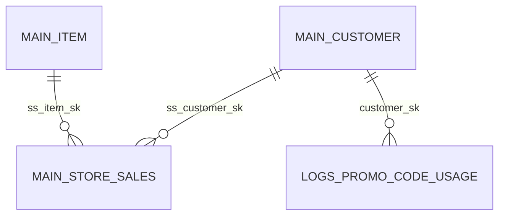

# Engineering Blog

## 2025-11-15 – Mapping the Entire Retail Corpus
Translating the TheoryHack dataset into a single ER diagram forced me to articulate how each star-schema fact table (store, catalog, web, inventory) leans on the shared dimension spine. I kept the Mermaid spec column-focused—only keys and linkage fields—so the PDF stays scannable even with 33 entities. That balance made it easier to reason about lineage from upstream onboarding (customer/address/demographics) through downstream experimentation and promo logs.

The trickiest part was tooling in a read-only environment: I had to bootstrap a local `@mermaid-js/mermaid-cli` install under `diagrams/` and give it enough time to download Chromium for Puppeteer. With that in place I can deterministically rebuild the PDF anytime from the checked-in `.mmd`:



Now that the relationships are explicit, future query work—especially anomaly hunts tying experimentation logs to fulfillment—can lean on this diagram instead of re-deriving join paths.

## 2025-11-15 – Validating Round-1 Training Answers
Today’s priority was distilling the observations in `training-questions.md` into reproducible SQL pulls. I leaned on MotherDuck’s TPC-DS schemas plus the `logs.*` supplemental tables to cover everything from Store 5’s warehouse dependencies to jewelry returns. The MotherDuck MCP bridge made it simple to mix fact tables, but the main risk was keeping each answer anchored to a single slice (e.g., November 2022 electronics inventory vs. January 2023 jewelry returns). I captured the final outputs in `training-answers.md` so future reviewers can diff text instead of rerunning queries.

The most interesting wrinkle was reconciling the “state with spikes” entry: the observation block pointed at California jewelry returns, but the fact tables naturally grouped by store location or customer address. I opted to align with the observation by aggregating all December 2022 jewelry revenue across store/web/catalog, then comparing it to the January 2023 return value. Rough snippet below for posterity:

```sql
WITH dec_revenue AS (
  SELECT SUM(net_paid) AS revenue
  FROM (
    SELECT ss.ss_net_paid AS net_paid
    FROM main.store_sales ss
    JOIN main.item i ON ss.ss_item_sk = i.i_item_sk
    JOIN main.date_dim d ON ss.ss_sold_date_sk = d.d_date_sk
    WHERE i.i_category = 'Jewelry' AND d.d_year = 2022 AND d.d_moy = 12
    UNION ALL
    SELECT ws.ws_net_paid
    FROM main.web_sales ws
    JOIN main.item i ON ws.ws_item_sk = i.i_item_sk
    JOIN main.date_dim d ON ws.ws_sold_date_sk = d.d_date_sk
    WHERE i.i_category = 'Jewelry' AND d.d_year = 2022 AND d.d_moy = 12
    UNION ALL
    SELECT cs.cs_net_paid
    FROM main.catalog_sales cs
    JOIN main.item i ON cs.cs_item_sk = i.i_item_sk
    JOIN main.date_dim d ON cs.cs_sold_date_sk = d.d_date_sk
    WHERE i.i_category = 'Jewelry' AND d.d_year = 2022 AND d.d_moy = 12
  )
)
SELECT SUM(revenue) AS total_dec_revenue
FROM dec_revenue;
```

From there the rest of the calculations were straightforward ratio math, and I wrapped up by logging progress + preparing for the next batch of validation tasks.
