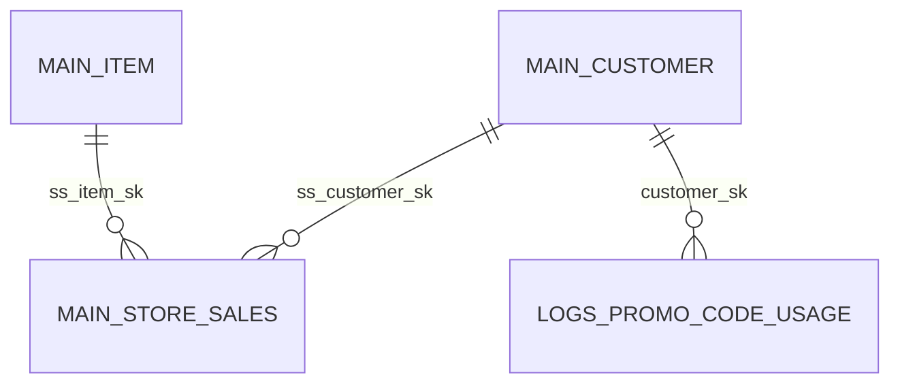

# Engineering Blog

## 2025-11-15 – Mapping the Entire Retail Corpus
Translating the TheoryHack dataset into a single ER diagram forced me to articulate how each star-schema fact table (store, catalog, web, inventory) leans on the shared dimension spine. I kept the Mermaid spec column-focused—only keys and linkage fields—so the PDF stays scannable even with 33 entities. That balance made it easier to reason about lineage from upstream onboarding (customer/address/demographics) through downstream experimentation and promo logs.

The trickiest part was tooling in a read-only environment: I had to bootstrap a local `@mermaid-js/mermaid-cli` install under `diagrams/` and give it enough time to download Chromium for Puppeteer. With that in place I can deterministically rebuild the PDF anytime from the checked-in `.mmd`:

Now that the relationships are explicit, future query work—especially anomaly hunts tying experimentation logs to fulfillment—can lean on this diagram instead of re-deriving join paths.
